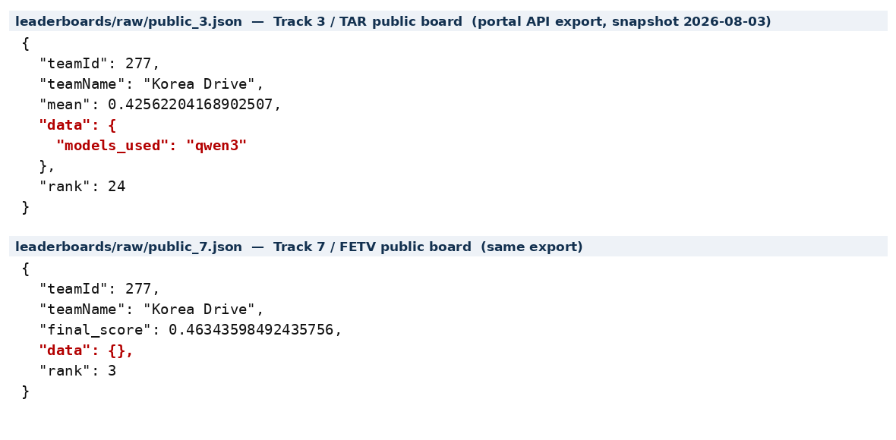

# Evidence for "the official TAR portal record (qwen3)"

Requested 2026-09-09 for the letter to the Track 7 organizer. This file says exactly
what the record is, where it came from, **and what it does not cover** — the last part
matters more than the first.



## The record

| | |
|---|---|
| File | [`leaderboards/raw/public_3.json`](leaderboards/raw/public_3.json) (identical entry in [`general_3.json`](leaderboards/raw/general_3.json)) |
| Source | `https://eval.aicitychallenge.org/aicity2026/submission/leaderboard/stats/<dtype>/3` — the portal's own API, exported verbatim |
| Snapshot | 2026-08-03, recorded in [`leaderboards/track3_tar_final.json`](leaderboards/track3_tar_final.json) (`exported_from_portal: true`) |

```json
{ "teamId": 277, "teamName": "Korea Drive",
  "mean": 0.42562204168902507,
  "data": { "models_used": "qwen3" },
  "rank": 24 }
```

The organizers can verify this against their own database; it is their field, filled in
by us at submission time, and we have not edited the export.

## What it does not show — read this before sending

**The FETV record's `data` object is empty.**

```json
{ "teamId": 277, "teamName": "Korea Drive",
  "final_score": 0.46343598492435756,
  "data": {},
  "rank": 3 }
```

PSI-VQA (`public_8.json`) is likewise `{}`. Track 2 says `"models_used": "1"`, which is
meaningless. The field was filled in inconsistently across our own submissions.

So the sentence *"This is confirmed by the official TAR portal record (qwen3)"* is true,
but it confirms **TAR only**. The determination under appeal is about FETV, and on FETV
the portal says nothing at all. An organizer who opens the FETV record to check will see
an empty declaration — which is the weaker fact, and they will see it whether or not we
mention it. Leading with the TAR field invites exactly that.

## The stronger evidence for FETV specifically

There is now a direct, checkable proof of which model produced the FETV artifacts, and
it does not depend on any declaration field.

On 2026-09-09 the FETV second pass of 2026-07-11 was re-run from the committed code with
`Qwen/Qwen3-VL-8B-Instruct` in bf16, and reproduced **byte-for-byte**:

| artifact | 2026-07-11 | re-run 2026-09-09 |
|---|---|---|
| `fetv_submission_v8.json` | `f3b17dec9e412133071776e5d42e0087e349e2ddf5c43229ff216e68f242523d` | identical |
| `fetv_v8_secondpass_raw.json` — raw model text for 134 clips | `3e86f58b3f3da2c36190107049d7862421e8bb80ab87bd6e90f7ef596150c366` | identical |

Reproducing 134 clips of raw generation bit for bit is only possible with the same
weights. No declaration field can be as strong as that, and anyone can run it:

```bash
# paths are relative to track3_anomaly/, which is where the script resolves them
cd track3_anomaly
python3 scripts/fetv_second_pass.py \
  --base submissions/fetv_submission_v7.json \
  --clips data/fetv/FETV_public_clips --quant bf16 \
  --out /tmp/x.json --sidecar /tmp/x_raw.json
sha256sum /tmp/x.json /tmp/x_raw.json submissions/fetv_submission_v8.json \
          submissions/fetv_v8_secondpass_raw.json
```

Expect `/tmp/x.json` to match `fetv_submission_v8.json` at
`f3b17dec9e412133071776e5d42e0087e349e2ddf5c43229ff216e68f242523d` and
`/tmp/x_raw.json` to match `fetv_v8_secondpass_raw.json` at
`3e86f58b3f3da2c36190107049d7862421e8bb80ab87bd6e90f7ef596150c366`. The run queries
134 clips and takes about 25 minutes on one RTX 3090. The clips are the public FETV
set, linked from [github.com/MoyoG/FETV](https://github.com/MoyoG/FETV).

Every FETV script in the repository also names the model directly:
`scripts/reproduce_fetv_official.sh` hardcodes `TAR_MODEL_ID="Qwen/Qwen3-VL-8B-Instruct"`,
and `track3_anomaly/scripts/inference.py` defaults to the same. No adapter weights are
tracked in the repository.

## Suggested wording

Replace

> This is confirmed by the official TAR portal record (qwen3), our camera-ready paper,
> and our released reproduction scripts.

with

> This is confirmed three ways. The evaluation portal's own record for our scored TAR
> submission carries `models_used: qwen3`. Our camera-ready paper states a frozen
> Qwen3-VL-8B-Instruct pipeline throughout. And for FETV specifically, re-running our
> published second pass today with Qwen3-VL-8B-Instruct in bf16 reproduces the July
> artifacts byte-for-byte — `fetv_submission_v8.json` at SHA256 `f3b17dec…` and the raw
> model output for all 134 clips it queried at `3e86f58b…` — which is only possible with
> the same weights. We should note that our portal `models_used` field was left empty on
> the FETV and PSI-VQA submissions; the declaration exists in the technical report, as
> the FAQ requires, and the reproduction above is offered in its place.

Volunteering the empty field costs nothing — it is visible in their database either way —
and it is what makes the rest of the letter credible.
